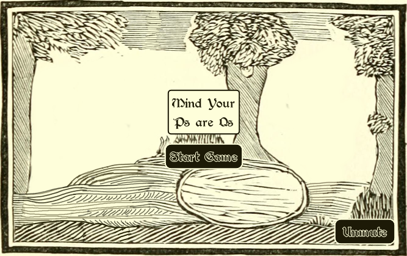
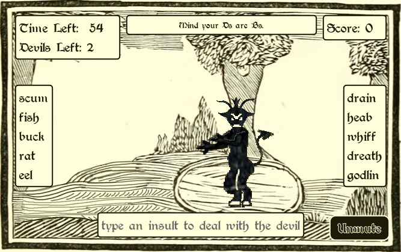
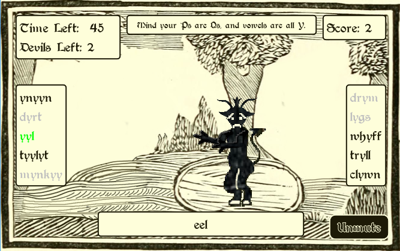

# Mind your Ps are Qs

Typing game made for [Godot Wild Jam](https://godotwildjam.com/) #54 with the theme of "[Curses](https://itch.io/jam/godot-wild-jam-54)" - Ranked #1 for Theme and #4 Overall.

  
  
  

## How to Play:

Try the game at: https://hoodscott.itch.io/mind-your-ps-are-qs

> A portal has opened and demons are pouring through.  We need to curse them back to hell.  However, a cursed aura surrounds the portal and affects your ability to think clearly.  Can you deal with these demons?
>
> To play: Type two words (one from the left list and one from the right) to combine into an insult.  Be mindful of your current curses as they will affect the letters in the lists making them harder to read.  Toggle mute with `Alt+M`.

## How to Build

Clone repository and open project with Godot ~v3.5.1.

## Credits:

- Background: Image from page 62 of "Chap-books of the eighteenth century" (1882), scanned by Internet Archive Book Images, https://www.flickr.com/photos/internetarchivebookimages/14780158621/
- Demon Head: Amy Hood
- Font: Augusta, Dieter Steffmann, http://www.steffmann.de/, https://www.dafont.com/augusta.font 
- Game Engine: Godot, https://godotengine.org/
- Music: The Medieval Banquet, Shane Ivers,  https://www.silvermansound.com/free-music/the-medieval-banquet
- Percussion: Medieval Perc, menegass, https://freesound.org/people/menegass/packs/5824/
- Trumpet: Medieval Fanfare, tobyk, https://freesound.org/s/26198/
